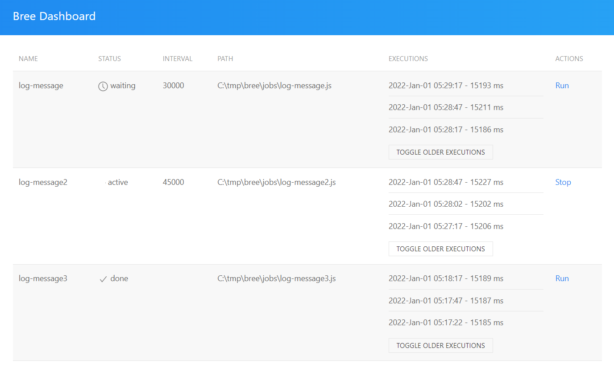
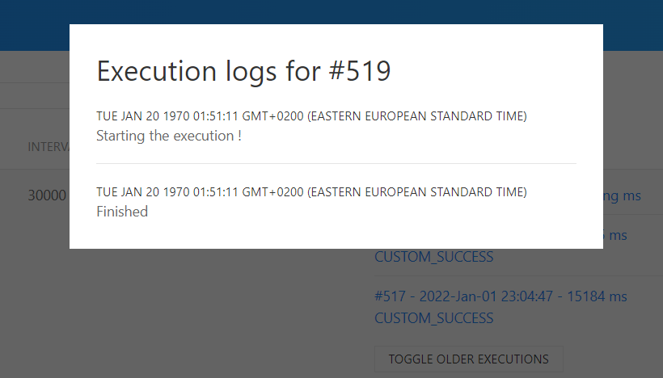

# Bree dashboard

A simple nodejs application to run and display bree jobs.

Bree: https://github.com/breejs/bree



## Install

```
git clone https://github.com/ionutvmi/bree-dashboard.git
cd bree-dashboard
pnpm install
pnpm run start
```

To change the port of the server set the `BREE_DASHBOARD_PORT` environment variable.

## Define the jobs

The jobs can be created in the `jobs` folder and configured in the `main.js` file.

If you would like to keep the jobs in a separate repository you can create
an `external-jobs/` folder and a file named `external-jobs/config.js` the which
will take priority over the configuration from `main.js`.

```sh
mkdir external-jobs
cd external-jobs
git init
touch config.js
```

The `external-jobs/config.js` file should export an object with job configurations.

```js
// external-jobs/config.js
const path = require('path');
module.exports = {
    root: __dirname,
    jobs: [
        {
            name: 'some-job',
            path: path.join(__dirname, 'some-job.js'),
            interval: '10s',
        },
    ],
    workerMessageHandler(metadata) {
        console.log('workerMessageHandler', metadata);
    },
};
```

## Workers

Example worker for an asynchronous flow:

```js
let AbstractWorker = require('../worker/AbstractWorker');

class Worker extends AbstractWorker {
    async run() {
        return new Promise((resolve, reject) => {
            this.logger.info('Starting the execution !');

            this.timeoutId = setTimeout(() => {
                this.logger.info('Finished');
                resolve('CUSTOM_SUCCESS');
            }, 15000);
        });
    }
    async onCancel() {
        clearTimeout(this.timeoutId);
    }
}

let worker = new Worker(__filename);
worker.start().catch(function (e) {
    console.error(e);
});
```

For synchronous flow:

```js
let AbstractWorker = require('../worker/AbstractWorker');

class Worker extends AbstractWorker {
    async run() {
        this.logger.info('Message logged right away.');

        if (Math.random() > 0.5) {
            return 'ERROR';
        }

        return 'EXECUTION_SUCCESSFUL';
    }
}

let worker = new Worker(__filename);
worker.start().catch(function (e) {
    console.error(e);
});
```

## Logs

The logs for the workers are stored in 2 locations:

-   on the disk in a file named log.txt
-   in a sqlite database jobs.db (for each execution)

When clicking on an execution log the information is displayed from the sqlite database file.


## Release notes

Feb 6th 2022

-   Stores the `uikit` library files locally
-   Adds support for chaining the server port via environment variables

Jan 8th 2022

-   Upgrades bree to the latest version
-   Adds support for the `external-jobs` folder to allow the maintenance of the jobs
    in a separate repo.

Jan 1st 2022

-   Initial release

## Author

Mihai Ionut Vilcu

-   [github/ionutvmi](https://github.com/ionutvmi)
-   [twitter/mihaivlc93](http://twitter.com/mihaivlc93)
